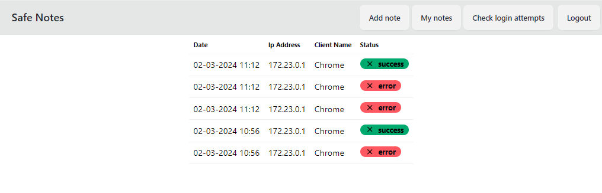

# Safe Notes 
<p>The Safe Notes App is a web application developed using ASP.NET Core and Angular, providing users with a secure platform to store and manage their text notes. The key features include:</p>

<ul>
    <li><strong>Note Storage:</strong> Users can securely store text notes with the flexibility to categorize them as public, private, or encrypted. Public notes are accessible to all users, private notes are only visible to the note owner, and encrypted notes require a password for access.</li>
    <li><strong>Authentication:</strong> The application requires Two-Factor Authentication (TOTP) in addition to JWT (JSON Web Tokens) for user authentication.</li>
    <li><strong>Note Sharing:</strong> Users can selectively share their notes with others, either to specific users or publicly. Sharing options include making notes public or sharing them with specific users.</li>
    <li><strong>Text Formatting:</strong> The note editor allows basic text styling, including bold, italic, headers, links, and external images.</li>
    <li><strong>Password Management:</strong> Secure password storage is ensured through the use of HMAC-SHA for hashing and salting. The system also checks the strength of passwords to enhance user security.</li>
    <li><strong>Secure Connection:</strong> All communications with the application are secured through SSL/TLS certificates, ensuring data integrity and privacy.</li>
    <li><strong>Brute-force Protection:</strong> To enhance security, the system incorporates delays and limits on login attempts to prevent remote guessing and brute-force attacks.</li>
    <li><strong>Login Attempt Monitoring:</strong> The application monitors and notifies users about login attempts, providing insights into account activity and enhancing security awareness.</li>
    <li><strong>Docker Containerization:</strong> The application is containerized using Docker, facilitating easy deployment and scalability.</li>
</ul>

# Technologies
  <ul>
        <li><strong>.NET Core:</strong> A cross-platform, high-performance framework for building modern, cloud-based, and internet-connected applications.</li>
        <li><strong>Angular:</strong> A powerful and widely-used frontend framework for building dynamic web applications.</li>
        <li><strong>PostgreSQL:</strong> An open-source, powerful, and scalable relational database system.</li>
        <li><strong>Nginx:</strong> A high-performance HTTP server and reverse proxy server.</li>
        <li><strong>SSL/TLS Certificate:</strong> For secure communication, the application will use an SSL/TLS certificate.</li>
        <li><strong>Authentication:</strong>
            <ul>
                <li><strong>JWT (JSON Web Tokens):</strong> A compact, URL-safe means of representing claims to be transferred between two parties.</li>
                <li><strong>TOTP (Time-based One-Time Password):</strong> An algorithm that involves a time-based component in addition to a user's secret key to generate unique and time-limited passwords.</li>
                <li><strong>Password Hashing (HMAC-SHA):</strong> Utilize HMAC-SHA as the password hashing algorithm along with a unique salt for each user to enhance password security.</li>
            </ul>
        </li>
        <li><strong>Encryption:</strong>
            <ul>
                <li><strong>AES (Advanced Encryption Standard):</strong> Utilize AES encryption to secure notes. Encrypt sensitive data before storing it in the database and decrypt it when retrieved.</li>
            </ul>
        </li>
        <li><strong>Docker:</strong> A platform for developing, shipping, and running applications in containers.</li>
    </ul>

# Running the Safe Notes App

To run the Safe Notes App locally, you can use Docker Compose for a straightforward setup. Follow the steps below:

## Prerequisites

- Ensure that Docker and Docker Compose are installed on your system.

## Steps

1. Clone the repository to your local machine:

    ```bash
    git clone https://github.com/MaciejKuzmicki/Safe-Notes
    cd Safe-Notes
    ```

2. Build and run the application using Docker Compose:

    ```bash
    docker-compose up --build
    ```

    This command will download the necessary images, build the application, and start the containers.

3. Access the application in your browser:

    Open your web browser and navigate to [http://localhost:4200](http://localhost:4200) to access the SecureNotes App.

## Notes

- The application frontend is hosted on port 4200 by default. If you encounter any issues, ensure that the port is available and not in use.

- Ensure that Docker Compose is properly configured and running on your machine.

- In case you need to stop the application, you can use `Ctrl + C` in the terminal where Docker Compose is running.

Enjoy using the Safe Notes App locally!

# Database Diagram


# Screenshots

<ul>
  <li><strong>Register form</strong></li>
  <br />
  
  
  <p>After registration you will be given your totp secret as a QR Code, add this into your authenticator</p>
  

  <li><strong>Login form</strong></li>
    <p>There is a limit on login attempts. Users are allowed to attempt login three times within a minute. Then you need to wait one minute to try again.</p>
  

  <li><strong>Public Notes</strong></li>
  <br />
  

  <li><strong>My Notes Encrypted</strong></li>
  <br />
  
  
  <li><strong>My Notes After Decryption</strong></li>
  <br />
  

  <li><strong>Login attempts</strong></li>
  <br />
  
  
  <li><strong>Add Public Note</strong></li>
  <br />
  

  <li><strong>Add Encrypted Note</strong></li>
  <br />
  

  
</ul>
